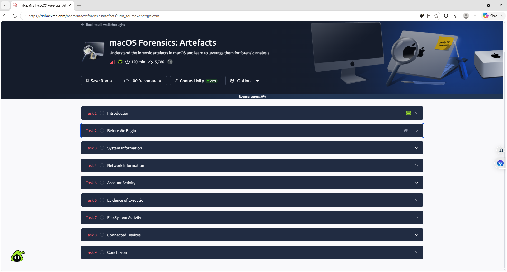
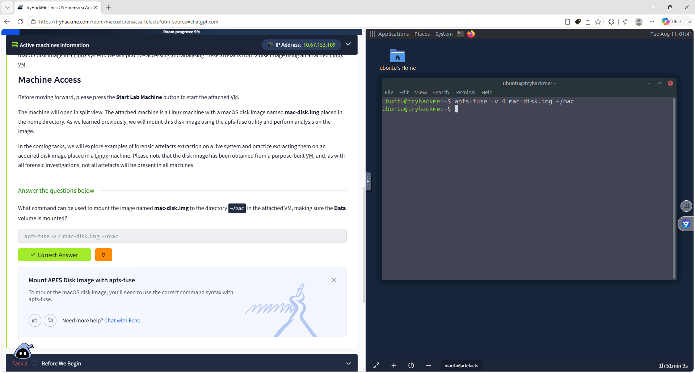
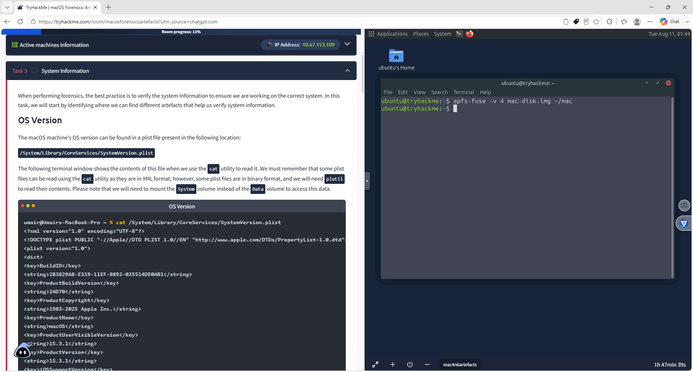
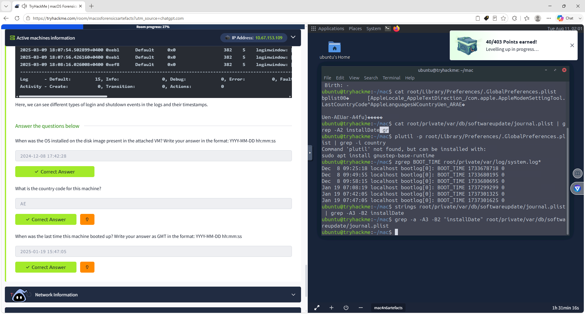
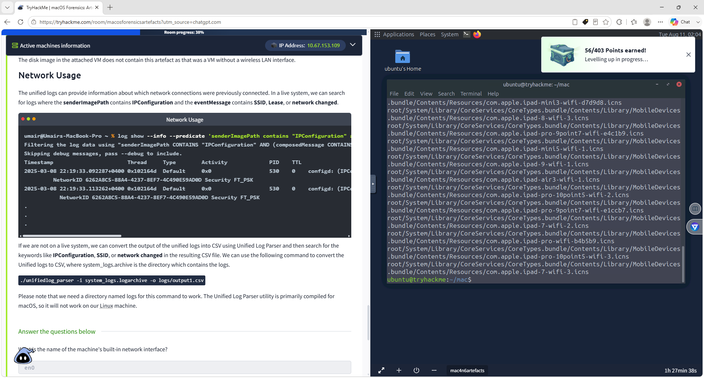
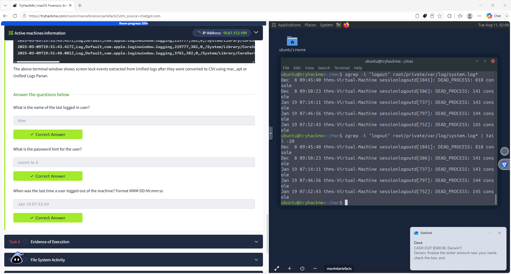
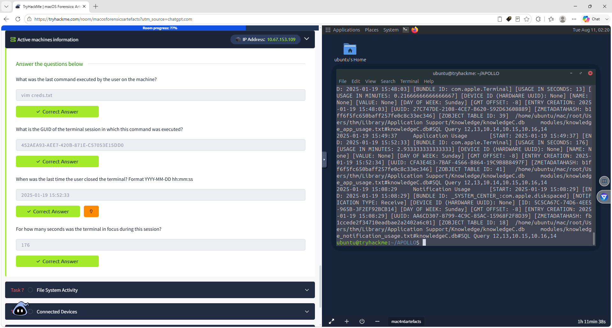
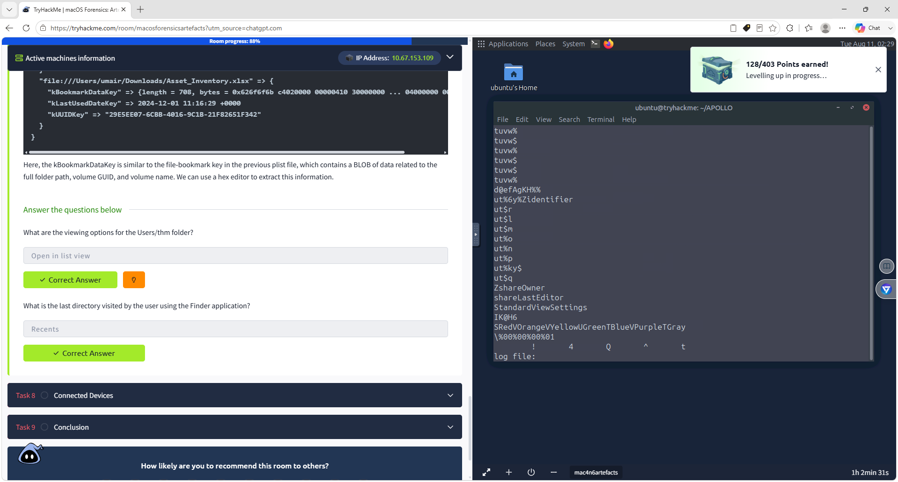
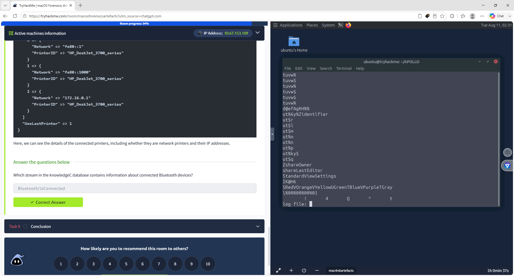
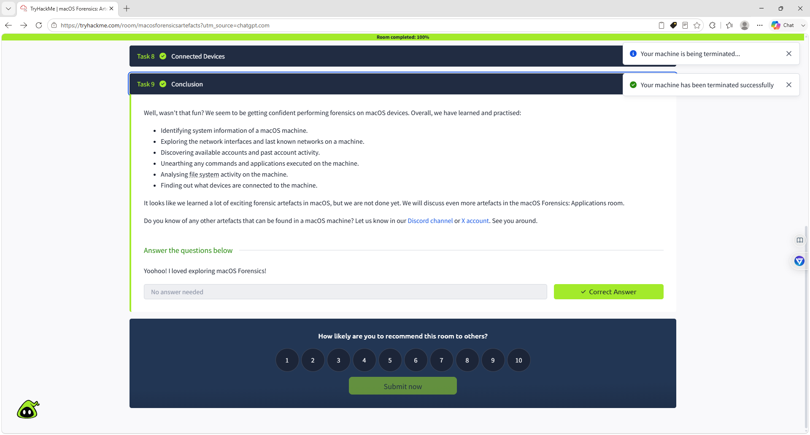

S# Darwin-SOC-macOS-Forensics-Artifact-Investigation-Lab
Hands-on macOS forensic investigation analyzing system, network, user, execution, Finder, and connected-device artifacts using TryHackMe, Linux, APOLLO, and KnowledgeC.

---

## Overview

This project documents a hands-on macOS forensic investigation completed using the TryHackMe **macOS Forensics: Artefacts** lab.

The investigation focused on mounting a macOS APFS forensic disk image and analyzing artifacts related to system information, network activity, user accounts, login/logout activity, command execution, application usage, Finder activity, file-system behavior, and connected devices.

The goal of this project was to strengthen practical SOC, DFIR, endpoint-investigation, and incident-response skills while documenting findings in a structured technical investigation.

---

## Skills Demonstrated

- macOS Forensics
- Digital Forensics
- SOC Investigation
- DFIR
- Endpoint Analysis
- Artifact Analysis
- APFS Disk Analysis
- Linux Command Line
- APOLLO Forensics
- KnowledgeC Analysis
- System Log Analysis
- User Activity Analysis
- Network Artifact Analysis
- Command Execution Analysis
- Timeline Reconstruction
- Finder Artifact Analysis
- Bluetooth Artifact Analysis
- Evidence Documentation
- Incident Investigation

---

## Tools Used

- TryHackMe
- Linux
- APFS-FUSE
- APOLLO
- KnowledgeC.db
- Terminal
- grep
- zgrep
- strings
- find
- stat

---

## Investigation Process

### Screenshot 1 – macOS Forensics Lab Overview

Started the TryHackMe **macOS Forensics: Artefacts** room and reviewed the forensic investigation objectives.

The lab covered:

- System Information
- Network Information
- Account Activity
- Evidence of Execution
- File System Activity
- Connected Devices



---

### Screenshot 2 – APFS Data Volume Mount

Mounted the macOS forensic disk image using `apfs-fuse`.

Command used:

```bash
apfs-fuse -v 4 mac-disk.img ~/mac
```

The APFS Data volume was selected so forensic artifacts could be examined from the attached Linux virtual machine.

This step provided access to the mounted macOS file system for further forensic analysis.



---

### Screenshot 3 – macOS System Information

Reviewed the macOS system information artifact located at:

```text
/System/Library/CoreServices/SystemVersion.plist
```

This artifact can provide information about the installed operating system, including macOS version and build information.

Identifying system information helps confirm the environment being investigated and provides context for other forensic artifacts.



---

### Screenshot 4 – System Information Verified

Analyzed macOS system artifacts and historical logs to identify important system information.

#### Verified Findings

- OS Installation Date: `2024-12-08 17:42:28`
- Country Code: `AE`
- Last Boot Time: `2025-01-19 15:47:05 GMT`

Example command:

```bash
zgrep BOOT_TIME root/private/var/log/system.log*
```

Historical boot records were used to help establish a system timeline.



---

### Screenshot 5 – Network Artifact Investigation

Investigated macOS network artifacts to identify network-interface and routing information.

#### Verified Findings

- Built-in Network Interface: `en0`
- Router IP Address: `192.168.64.1`

Network artifacts can help investigators understand how an endpoint communicated and identify network interfaces, gateways, and previously used network configurations.



---

### Screenshot 6 – Account Activity Verified

Investigated macOS user-account artifacts and historical system logs to identify account activity.

#### Verified Findings

- Last Logged-In User: `thm`
- Password Hint: `count to 5`
- Last Logout Time: `Jan 19 07:52:43`

Example command:

```bash
zgrep -i "logout" root/private/var/log/system.log*
```

This evidence helped establish which user was active on the system and when the session ended.



---

### Screenshot 7 – Evidence of Execution Verified

Used APOLLO and the macOS KnowledgeC database to investigate command execution and application usage.

KnowledgeC database location:

```text
/Users/thm/Library/Application Support/Knowledge/knowledgeC.db
```

#### Verified Findings

- Last Command Executed: `vim creds.txt`
- Terminal Session GUID: `452AEA93-AEE7-420B-871E-C57053E15DD0`
- Terminal Closed: `2025-01-19 15:52:33`
- Terminal Focus Duration: `176 seconds`

This demonstrated how macOS activity databases can be used to reconstruct user actions and application activity.



---

### Screenshot 8 – File System Activity Verified

Analyzed macOS Finder artifacts to identify recent file-system activity and folder-view preferences.

#### Verified Findings

- `/Users/thm` View Setting: `Open in list view`
- Last Finder Directory: `Recents`

Finder artifacts can help determine which locations a user recently interacted with during an investigation.



---

### Screenshot 9 – Connected Devices Verified

Reviewed macOS KnowledgeC artifacts associated with connected Bluetooth devices.

#### Verified KnowledgeC Stream

```text
Bluetooth/isConnected
```

Connected-device artifacts can help identify external devices or peripherals associated with the endpoint.



---

### Screenshot 10 – Lab Completion

Successfully completed the TryHackMe **macOS Forensics: Artefacts** room at 100%.

The investigation included:

- macOS system-information analysis
- APFS disk-image mounting
- Network artifact analysis
- User-account investigation
- Historical login and logout analysis
- Command-execution reconstruction
- APOLLO and KnowledgeC analysis
- Finder activity investigation
- File-system artifact analysis
- Connected-device investigation
- Forensic timeline development



---

## Key Findings

| Category | Finding |
|---|---|
| OS Installation Date | `2024-12-08 17:42:28` |
| Country Code | `AE` |
| Last Boot | `2025-01-19 15:47:05 GMT` |
| Network Interface | `en0` |
| Router IP | `192.168.64.1` |
| Last Logged-In User | `thm` |
| Password Hint | `count to 5` |
| Last Logout | `Jan 19 07:52:43` |
| Last Command | `vim creds.txt` |
| Terminal Session GUID | `452AEA93-AEE7-420B-871E-C57053E15DD0` |
| Terminal Closed | `2025-01-19 15:52:33` |
| Terminal Focus Time | `176 seconds` |
| Finder View | `Open in list view` |
| Last Finder Directory | `Recents` |
| Bluetooth Stream | `Bluetooth/isConnected` |

---

## SOC / DFIR Relevance

This project demonstrates hands-on skills relevant to SOC Analyst, Cybersecurity Analyst, Incident Response, and DFIR roles.

Key skills practiced include:

- Endpoint forensic investigation
- macOS artifact identification
- Evidence collection
- System log analysis
- User-account investigation
- Command-execution reconstruction
- Network artifact analysis
- Timeline reconstruction
- Application activity analysis
- File-system investigation
- Connected-device analysis
- Linux-based forensic analysis
- Technical documentation

These techniques can support investigations involving:

- Suspicious endpoint behavior
- Account compromise
- Unauthorized access
- Malware execution
- Insider threats
- Suspicious command activity
- Unauthorized device connections
- Data-access investigations
- Incident response

---

## What I Learned

This lab strengthened my understanding of how forensic evidence is stored on macOS systems and how multiple artifacts can be combined to reconstruct system and user activity.

I gained hands-on experience working with:

- APFS disk images
- macOS plist artifacts
- Historical system logs
- KnowledgeC databases
- APOLLO forensic tooling
- Finder artifacts
- Bluetooth artifacts
- Linux forensic commands

The investigation reinforced the importance of validating findings through multiple sources of evidence and documenting each step of the forensic process.

---

## Conclusion

This project provided hands-on experience investigating a macOS forensic disk image and extracting useful evidence from system files, historical logs, preference files, Finder artifacts, account information, and the KnowledgeC database.

Using Linux command-line tools and APOLLO, I was able to identify system information, investigate network activity, reconstruct user sessions, recover command-execution evidence, examine Finder activity, analyze connected devices, and document the findings in a structured forensic investigation.

This lab expanded my SOC and incident-response experience beyond Windows environments and strengthened my ability to investigate macOS endpoints using practical DFIR techniques.

